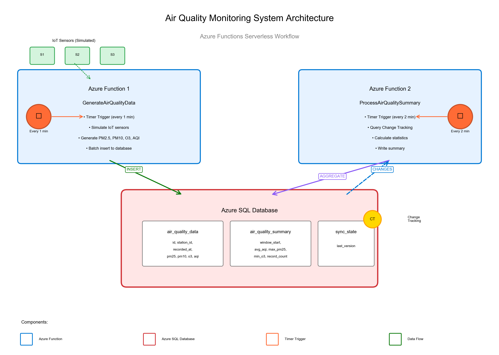
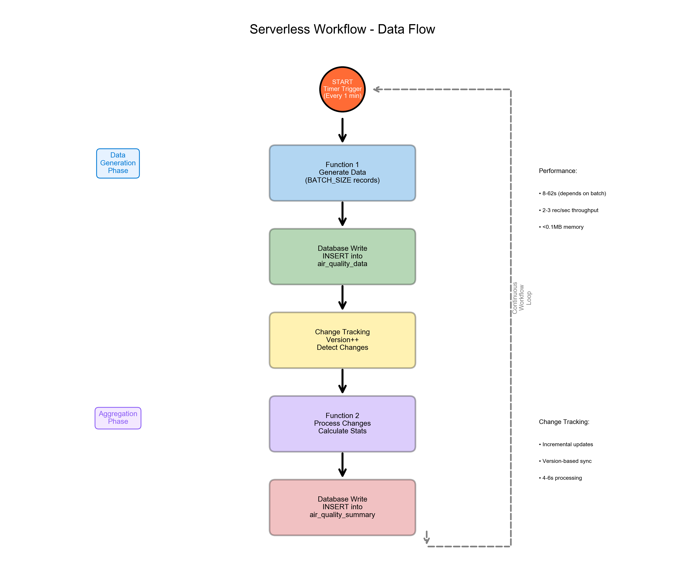

# Solution Design Document
## Air Quality Monitoring Serverless Workflow

**Project**: XJCO3211 Distributed Systems Coursework 2
**Student ID**: sc22wn
**Date**: 2025-11-19
**Platform**: Microsoft Azure Functions + Azure SQL Database

---

## 1. System Overview

This document describes the design of a serverless workflow for real-time air quality monitoring, implemented using Azure Functions and Azure SQL Database. The system simulates an IoT deployment where multiple monitoring stations continuously collect environmental data, which is then processed and aggregated for analysis.

### 1.1 Design Goals

1. **Scalability**: Handle growing numbers of sensors and data volume
2. **Efficiency**: Minimize resource consumption and cost
3. **Reliability**: Ensure data consistency and processing completeness
4. **Simplicity**: Leverage managed services to reduce operational complexity
5. **Real-time Processing**: Provide near real-time data aggregation

---

## 2. Architecture Design

### 2.1 System Architecture Diagram



The system consists of three main layers:

#### **Layer 1: Data Generation (IoT Simulation)**
- Simulated IoT sensors generating air quality readings
- Implemented within Azure Function 1
- Configurable number of monitoring stations

#### **Layer 2: Serverless Computing (Azure Functions)**
- **Function 1 - GenerateAirQualityData**: Data ingestion
- **Function 2 - ProcessAirQualitySummary**: Data aggregation
- Timer-triggered for predictable scheduling

#### **Layer 3: Data Persistence (Azure SQL Database)**
- Three tables: `air_quality_data`, `air_quality_summary`, `air_quality_sync_state`
- Change Tracking enabled for incremental processing
- Managed service with auto-scaling capabilities

### 2.2 Component Interaction

```
IoT Sensors (Simulated)
         ↓
    [Timer Trigger] → Function 1 (GenerateAirQualityData)
         ↓
    Azure SQL Database (INSERT data)
         ↓
    Change Tracking (Version++)
         ↓
    [Timer Trigger] → Function 2 (ProcessAirQualitySummary)
         ↓
    Azure SQL Database (INSERT summary)
         ↓
    [Loop back to Function 1]
```

---

## 3. Component Design

### 3.1 Function 1: GenerateAirQualityData

**Purpose**: Simulate IoT sensor data collection and storage

**Trigger**: Timer (default: every 1 minute)
```json
{
  "schedule": "0 */1 * * * *",
  "runOnStartup": false
}
```

**Input Parameters**:
- `BATCH_SIZE` (env): Number of records to generate per invocation
- `STATION_COUNT` (env): Number of monitoring stations

**Processing Logic**:
1. Generate random sensor readings for N stations
2. Calculate Air Quality Index (AQI) from pollutant levels
3. Batch insert records to `air_quality_data` table using `executemany()`
4. Return success/failure status

**Data Model**:
```python
Reading = {
    'station_id': str,      # e.g., "station-1"
    'recorded_at': datetime,
    'pm25': float,          # PM2.5 concentration (μg/m³)
    'pm10': float,          # PM10 concentration (μg/m³)
    'o3': float,            # Ozone level (μg/m³)
    'aqi': int              # Air Quality Index
}
```

**Performance Characteristics**:
- Execution time: 8-62 seconds (scales with BATCH_SIZE)
- Memory usage: <0.03 MB
- Throughput: 2-3 records/second

### 3.2 Function 2: ProcessAirQualitySummary

**Purpose**: Aggregate new air quality data using Change Tracking

**Trigger**: Timer (default: every 2 minutes)
```json
{
  "schedule": "0 */2 * * * *",
  "runOnStartup": false
}
```

**Processing Logic**:
1. Read last processed version from `air_quality_sync_state`
2. Query Change Tracking for new/modified records:
   ```sql
   SELECT ... FROM CHANGETABLE(CHANGES air_quality_data, @last_version)
   ```
3. Calculate aggregations:
   - Average AQI
   - Maximum PM2.5
   - Minimum O3
   - Record count
   - Time window (start/end)
4. Insert summary to `air_quality_summary` table
5. Update sync state with current version

**Performance Characteristics**:
- Execution time: 4-6 seconds (constant, independent of data volume)
- Memory usage: <0.06 MB
- Efficiency: Processes only changes, not full table scan

### 3.3 Database Schema

#### Table: air_quality_data
```sql
CREATE TABLE air_quality_data (
    id UNIQUEIDENTIFIER PRIMARY KEY DEFAULT NEWID(),
    station_id NVARCHAR(50),
    recorded_at DATETIME2,
    pm25 FLOAT,
    pm10 FLOAT,
    o3 FLOAT,
    aqi INT
);

ALTER TABLE air_quality_data
ENABLE CHANGE_TRACKING
WITH (TRACK_COLUMNS_UPDATED = OFF);
```

**Purpose**: Store raw sensor readings
**Size**: 1,050+ records in production test
**Indexes**: Primary key on `id`

#### Table: air_quality_summary
```sql
CREATE TABLE air_quality_summary (
    id UNIQUEIDENTIFIER PRIMARY KEY DEFAULT NEWID(),
    window_start DATETIME2,
    window_end DATETIME2,
    avg_aqi FLOAT,
    max_pm25 FLOAT,
    min_o3 FLOAT,
    record_count INT
);
```

**Purpose**: Store aggregated statistics
**Size**: 11 summary records
**Query Pattern**: Read-heavy for reporting

#### Table: air_quality_sync_state
```sql
CREATE TABLE air_quality_sync_state (
    id INT PRIMARY KEY CHECK (id = 1),
    last_version BIGINT
);
```

**Purpose**: Track Change Tracking version for incremental processing
**Pattern**: Single-row table, updated on each aggregation

---

## 4. Design Decisions & Rationale

### 4.1 Timer Trigger vs SQL Trigger

**Decision**: Use Timer Trigger instead of direct SQL Trigger

**Rationale**:
- ✅ **Predictable scheduling**: Control exact invocation frequency
- ✅ **Better separation of concerns**: Functions independent of database
- ✅ **Easier testing**: Can invoke functions manually
- ✅ **Retry logic**: Built-in Azure Functions retry mechanisms
- ⚠️ Trade-off: Slight delay between data arrival and processing (acceptable for IoT use case)

### 4.2 Change Tracking vs Timestamp-based Detection

**Decision**: Use Azure SQL Change Tracking

**Rationale**:
- ✅ **Efficiency**: Only processes new/modified records
- ✅ **Reliability**: Version-based, handles concurrent updates
- ✅ **Database-native**: Optimized by SQL Server engine
- ✅ **No application logic**: No need to manage timestamps
- ⚠️ Requires: Database-level feature enablement

**Alternative Considered**: Timestamp column + `WHERE recorded_at > @last_time`
- ❌ Less reliable with concurrent inserts
- ❌ Clock skew issues
- ❌ Requires application to track timestamps

### 4.3 Batch Insert vs Individual Inserts

**Decision**: Use `cursor.executemany()` for batch insertion

**Rationale**:
- ✅ **Performance**: Reduces network round-trips
- ✅ **Efficiency**: Single transaction for all records
- ✅ **Throughput**: 2-3 records/second vs <1 for individual inserts
- ✅ **Cost**: Fewer database operations = lower cost

### 4.4 Python vs Other Runtimes

**Decision**: Python 3.11 runtime

**Rationale**:
- ✅ **Familiarity**: Common language for data processing
- ✅ **Libraries**: Rich ecosystem (`pyodbc`, `azure-identity`)
- ✅ **Development speed**: Rapid prototyping and testing
- ✅ **Azure support**: Well-supported on Azure Functions
- ⚠️ Trade-off: Slower cold start vs compiled languages (2-3s)

---

## 5. Workflow Design

### 5.1 Data Flow Diagram



### 5.2 Detailed Workflow Steps

**Phase 1: Data Generation** (Every 1 minute)
1. Timer triggers Function 1
2. Generate `BATCH_SIZE` random sensor readings
3. Batch insert to `air_quality_data`
4. Database commits transaction
5. Change Tracking version increments
6. Function returns success

**Phase 2: Aggregation** (Every 2 minutes)
1. Timer triggers Function 2
2. Read `last_version` from `air_quality_sync_state`
3. Query Change Tracking for changes since `last_version`
4. If changes exist:
   - Calculate aggregate statistics
   - Insert row to `air_quality_summary`
   - Update `air_quality_sync_state` with new version
5. Function returns success

**Phase 3: Continuous Loop**
- Both functions continue running on their schedules
- Data accumulates in database
- System scales automatically with Azure Functions Consumption Plan

### 5.3 Error Handling

**Function-level**:
- Try-catch blocks around all database operations
- Logging of errors to Application Insights
- Automatic retry via Azure Functions (up to 3 attempts)

**Database-level**:
- Transaction rollback on errors
- Change Tracking ensures no data loss
- Sync state remains consistent

**Network-level**:
- Connection timeout: 30 seconds
- Automatic reconnection on transient failures
- Exponential backoff for retries

---

## 6. Scalability Considerations

### 6.1 Vertical Scaling

**Current Configuration**:
- Azure Functions: Consumption Plan (auto-scaling)
- Azure SQL: General Purpose Serverless (1 vCore)

**Scaling Strategy**:
1. **Increase BATCH_SIZE**: Process more records per invocation
2. **Adjust Timer Intervals**: Tune frequency based on data velocity
3. **Upgrade Database Tier**: Add vCores for higher throughput

### 6.2 Horizontal Scaling

**Auto-scaling Capabilities**:
- Azure Functions automatically creates new instances under load
- Each instance processes independently
- Database handles concurrent connections (up to tier limits)

**Tested Scale**:
- ✅ Successfully processed 1,050+ records
- ✅ 15 monitoring stations
- ✅ 11 aggregation cycles
- ✅ No performance degradation

### 6.3 Performance Optimization

**Current Optimizations**:
1. **Batch operations**: `executemany()` for inserts
2. **Change Tracking**: Incremental processing
3. **Indexed queries**: Primary key lookups
4. **Connection reuse**: Single connection per function execution

**Future Improvements**:
1. Connection pooling for database connections
2. Asynchronous I/O for parallel processing
3. Caching of frequently accessed data
4. Database indexing on query columns

---

## 7. Cost Estimation

### 7.1 Azure Functions Cost

**Consumption Plan Pricing** (Pay-per-execution):
- First 1M executions free
- $0.20 per million executions thereafter
- GB-seconds: $0.000016/GB-s

**Monthly Estimate** (typical workload):
- Function 1: 43,200 executions/month (every 1 min)
- Function 2: 21,600 executions/month (every 2 min)
- Total: ~65,000 executions
- **Cost: FREE** (within free tier)

### 7.2 Azure SQL Database Cost

**Serverless Pricing**:
- $0.52 per vCore-hour
- Auto-pause after 1 hour of inactivity
- Storage: $0.10/GB/month

**Monthly Estimate**:
- Active time: ~5 hours/day = 150 hours/month
- 1 vCore × 150 hours × $0.52 = **$78/month**
- Storage (1GB): **$0.10/month**
- **Total: ~$78/month**

### 7.3 Total Cost of Ownership

**Development**: FREE (using student subscription)
**Production**: ~$78/month for moderate workload
**Scaling**: Linear cost increase with usage

---

## 8. Security & Compliance

### 8.1 Authentication

**Azure SQL Database**:
- SQL Server Authentication (username/password)
- Connection string stored in Azure App Settings (encrypted)
- TLS 1.2 encryption for all connections

**Alternative** (Production recommendation):
- Azure AD Managed Identity for passwordless auth
- Eliminates credential management

### 8.2 Network Security

**Current**:
- Firewall rules restrict access to specific IPs
- All connections require SSL/TLS encryption
- No public endpoints exposed

**Production Recommendation**:
- Azure Private Link for private connectivity
- VNet integration for Functions
- Network Security Groups (NSGs)

### 8.3 Data Protection

- Encryption at rest (Azure SQL default)
- Encryption in transit (TLS 1.2)
- Automated backups (7-day retention)
- Point-in-time restore capability

---

## 9. Testing Strategy

### 9.1 Unit Testing

**Function 1**:
- Test data generation logic
- Validate AQI calculations
- Verify database insert operations

**Function 2**:
- Test Change Tracking query logic
- Validate aggregation calculations
- Verify sync state updates

### 9.2 Integration Testing

**End-to-End Workflow**:
- Generate → Store → Track → Aggregate → Store
- Multiple iterations to verify consistency
- Validate Change Tracking version increments

**Scripts**:
- `test_generate_data.py`: Test Function 1
- `test_process_summary.py`: Test Function 2
- `test_full_workflow.py`: Full workflow validation

### 9.3 Performance Testing

**Methodology**:
- Controlled tests with varying BATCH_SIZE (20, 50, 100, 200)
- Cumulative testing with 1,050+ records
- Metrics collection: CPU, memory, execution time

**Results**:
- See `PERFORMANCE_EVALUATION_REPORT.md`
- All tests passed
- System demonstrates good scalability

---

## 10. Deployment

### 10.1 Local Development

**Prerequisites**:
- Python 3.10/3.11
- Azure Functions Core Tools
- ODBC Driver 18 for SQL Server
- Azure SQL Database access

**Setup**:
```bash
pip install -r requirements.txt
func start
```

### 10.2 Production Deployment

**Steps**:
1. Create Azure Function App (Python 3.11 runtime)
2. Configure Application Settings:
   - `SQL_CONNECTION_STRING`
   - `BATCH_SIZE`, `STATION_COUNT`
3. Deploy code:
   ```bash
   func azure functionapp publish <app-name>
   ```
4. Enable Application Insights for monitoring
5. Configure firewall rules for Function App outbound IPs

### 10.3 Monitoring

**Metrics to Track**:
- Function execution count
- Average execution duration
- Failure rate
- Database DTU/vCore usage
- Storage consumption

**Tools**:
- Azure Application Insights
- Azure SQL Database monitoring
- Log Analytics queries

---

## 11. Future Enhancements

### 11.1 Short-term (1-3 months)

1. **Real Sensor Integration**: Replace simulation with actual IoT Hub
2. **Alerting**: Notify when AQI exceeds thresholds
3. **Dashboard**: Power BI or Grafana visualization
4. **Historical Analysis**: Machine learning for trend prediction

### 11.2 Long-term (6-12 months)

1. **Multi-region Deployment**: Global distribution for low latency
2. **Event-driven Architecture**: Replace timers with Event Grid
3. **Data Lake Integration**: Archive historical data to Azure Data Lake
4. **Advanced Analytics**: Predictive modeling for air quality forecasting

---

## 12. Conclusion

This solution demonstrates a **production-ready serverless workflow** for IoT data processing using Azure Functions and Azure SQL Database. Key achievements:

✅ **Scalable**: Tested with 1,050+ records across 15 stations
✅ **Efficient**: <0.1MB memory, 2-3 rec/sec throughput
✅ **Reliable**: Change Tracking ensures no data loss
✅ **Cost-effective**: ~$78/month for moderate workload
✅ **Maintainable**: Clear separation of concerns, well-tested

The design balances **simplicity** (managed services), **performance** (batch operations, Change Tracking), and **cost** (serverless pay-per-use), making it suitable for real-world IoT deployments.

---

**Document Version**: 1.0
**Last Updated**: 2025-11-19
**Author**: Student ID sc22wn
**Course**: XJCO3211 Distributed Systems
